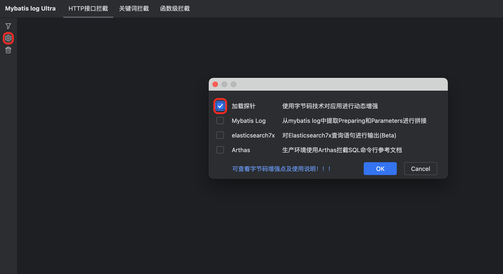
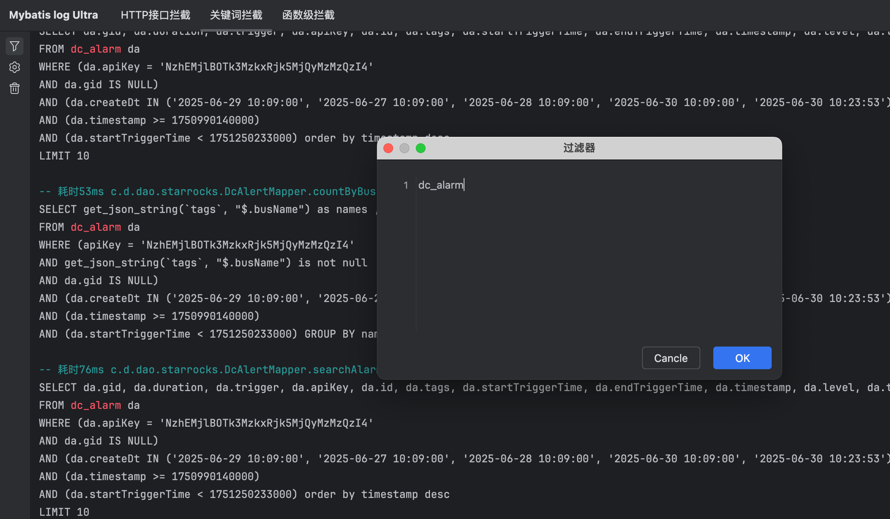
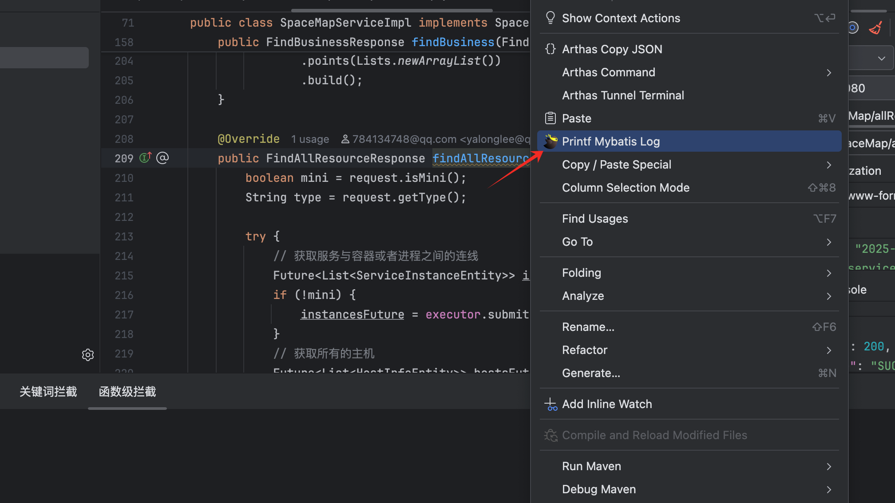

# 课后知识点

MyBatis在原则上无法直接记录完整的SQL查询。为了记录查询，所有参数都需要被序列化并表示为字符串。
```shell
==>  Preparing: SELECT * FROM event WHERE 1=1 and `enabled` = ?
==> Parameters: true(Boolean)
<==      Total: 8
```
对于简单的数据类型（如String或Integer），这并不成问题，但对于更复杂的数据类型（如Timestamp或Blob），其表示方式可能依赖于具体的数据库。 当查询执行时，并不需要将参数转换为字符串，因为JDBC驱动程序会以更高效（且数据库依赖的）格式将它们传递给数据库。然而，出于日志记录的目的，MyBatis只能获取到Java对象，而MyBatis并不知道如何将它们表示为数据库特定的字符串字面量。 因此，你能实现的最佳方案（这也是MyBatis所支持的）是记录带有占位符的查询，并单独记录使用的参数，这也是我们常见到的。

但是，很多情况下，我们的SQL查询当中并不会使用到很复杂的数据类型，如果能将拼接好的SQL直接输出到控制台的话，这将极大的提高我们日常开发/调试时的效率。

# 字节码增强点

```java
@Override
public <E> List<E> query(MappedStatement ms, Object parameter, RowBounds rowBounds, ResultHandler resultHandler, CacheKey key, BoundSql boundSql) throws SQLException {
    // ...
    return list;
}
```

```java
@Override
public int update(MappedStatement ms, Object parameter) throws SQLException {
    // ...
    return doUpdate(ms, parameter);
}
```

# 加载探针，启动时会主动增强@RestController增强的类


# 填写关键词，匹配到关键词的SQL将会被打印


# 指定拦截的函数，函数内执行的所有SQL都将会被打印
